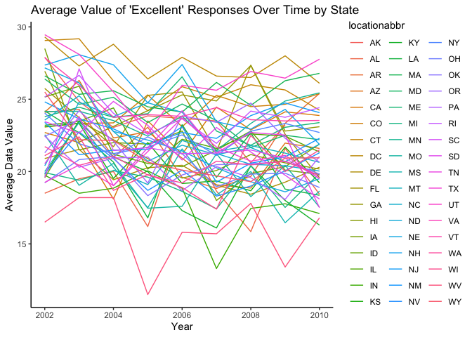
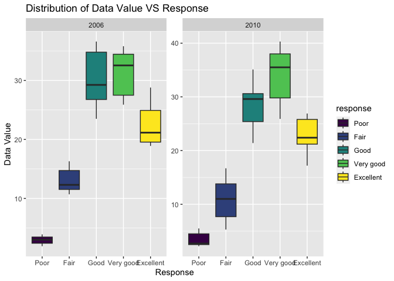
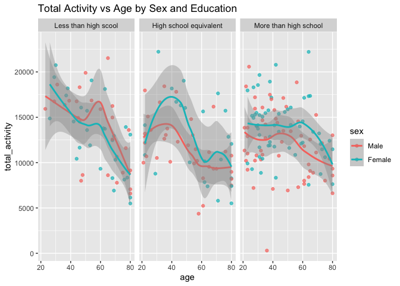
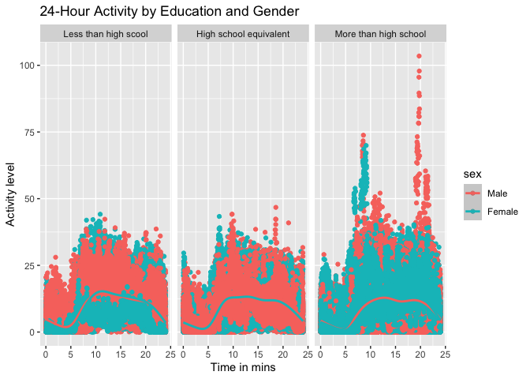

p8105_hw3_ph2283
================
2023-10-10

Q1

``` r
library(p8105.datasets)
library(tidyverse)
```

    ## ── Attaching core tidyverse packages ──────────────────────── tidyverse 2.0.0 ──
    ## ✔ dplyr     1.1.3     ✔ readr     2.1.4
    ## ✔ forcats   1.0.0     ✔ stringr   1.5.0
    ## ✔ ggplot2   3.4.3     ✔ tibble    3.2.1
    ## ✔ lubridate 1.9.2     ✔ tidyr     1.3.0
    ## ✔ purrr     1.0.2     
    ## ── Conflicts ────────────────────────────────────────── tidyverse_conflicts() ──
    ## ✖ dplyr::filter() masks stats::filter()
    ## ✖ dplyr::lag()    masks stats::lag()
    ## ℹ Use the conflicted package (<http://conflicted.r-lib.org/>) to force all conflicts to become errors

``` r
library(dplyr)
library(readxl)
```

#### Read in the data

``` r
data("instacart")

instacart = 
  instacart |> 
  as_tibble()
```

#### Answer questions about the data

This dataset contains 1384617 rows and 15 columns, with each row
resprenting a single product from an instacart order. Variables include
identifiers for user, order, and product; the order in which each
product was added to the cart. There are several order-level variables,
describing the day and time of the order, and number of days since prior
order. Then there are several item-specific variables, describing the
product name (e.g. Yogurt, Avocado), department (e.g. dairy and eggs,
produce), and aisle (e.g. yogurt, fresh fruits), and whether the item
has been ordered by this user in the past. In total, there are 39123
products found in 131209 orders from 131209 distinct users.

Below is a table summarizing the number of items ordered from aisle. In
total, there are 134 aisles, with fresh vegetables and fresh fruits
holding the most items ordered by far.

``` r
instacart |> 
  count(aisle) |> 
  arrange(desc(n))
```

    ## # A tibble: 134 × 2
    ##    aisle                              n
    ##    <chr>                          <int>
    ##  1 fresh vegetables              150609
    ##  2 fresh fruits                  150473
    ##  3 packaged vegetables fruits     78493
    ##  4 yogurt                         55240
    ##  5 packaged cheese                41699
    ##  6 water seltzer sparkling water  36617
    ##  7 milk                           32644
    ##  8 chips pretzels                 31269
    ##  9 soy lactosefree                26240
    ## 10 bread                          23635
    ## # ℹ 124 more rows

Next is a plot that shows the number of items ordered in each aisle.
Here, aisles are ordered by ascending number of items.

``` r
instacart |> 
  count(aisle) |> 
  filter(n > 10000) |> 
  mutate(aisle = fct_reorder(aisle, n)) |> 
  ggplot(aes(x = aisle, y = n)) + 
  geom_point() + 
  labs(title = "Number of items ordered in each aisle") +
  theme(axis.text.x = element_text(angle = 60, hjust = 1))
```

<!-- -->

Our next table shows the three most popular items in aisles
`baking ingredients`, `dog food care`, and `packaged vegetables fruits`,
and includes the number of times each item is ordered in your table.

``` r
instacart |> 
  filter(aisle %in% c("baking ingredients", "dog food care", "packaged vegetables fruits")) |>
  group_by(aisle) |> 
  count(product_name) |> 
  mutate(rank = min_rank(desc(n))) |> 
  filter(rank < 4) |> 
  arrange(desc(n)) |>
  knitr::kable()
```

| aisle                      | product_name                                  |    n | rank |
|:---------------------------|:----------------------------------------------|-----:|-----:|
| packaged vegetables fruits | Organic Baby Spinach                          | 9784 |    1 |
| packaged vegetables fruits | Organic Raspberries                           | 5546 |    2 |
| packaged vegetables fruits | Organic Blueberries                           | 4966 |    3 |
| baking ingredients         | Light Brown Sugar                             |  499 |    1 |
| baking ingredients         | Pure Baking Soda                              |  387 |    2 |
| baking ingredients         | Cane Sugar                                    |  336 |    3 |
| dog food care              | Snack Sticks Chicken & Rice Recipe Dog Treats |   30 |    1 |
| dog food care              | Organix Chicken & Brown Rice Recipe           |   28 |    2 |
| dog food care              | Small Dog Biscuits                            |   26 |    3 |

Finally is a table showing the mean hour of the day at which Pink Lady
Apples and Coffee Ice Cream are ordered on each day of the week. This
table has been formatted in an untidy manner for human readers. Pink
Lady Apples are generally purchased slightly earlier in the day than
Coffee Ice Cream, with the exception of day 5.

``` r
instacart |>
  filter(product_name %in% c("Pink Lady Apples", "Coffee Ice Cream")) |>
  group_by(product_name, order_dow) |>
  summarize(mean_hour = mean(order_hour_of_day)) |>
  pivot_wider(
    names_from = order_dow, 
    values_from = mean_hour) |>
  knitr::kable(digits = 2)
```

    ## `summarise()` has grouped output by 'product_name'. You can override using the
    ## `.groups` argument.

| product_name     |     0 |     1 |     2 |     3 |     4 |     5 |     6 |
|:-----------------|------:|------:|------:|------:|------:|------:|------:|
| Coffee Ice Cream | 13.77 | 14.32 | 15.38 | 15.32 | 15.22 | 12.26 | 13.83 |
| Pink Lady Apples | 13.44 | 11.36 | 11.70 | 14.25 | 11.55 | 12.78 | 11.94 |

Q2

``` r
library(p8105.datasets)
```

``` r
# Import the data
data("brfss_smart2010")

# Clean the data
cleaned_bs2010 <- brfss_smart2010 |>
  janitor::clean_names() |>
  filter(topic == "Overall Health",
         response %in% c("Excellent", "Very good", "Good", "Fair", "Poor")) |>
  mutate(response = factor(response, levels = c("Poor", "Fair", "Good", "Very good", "Excellent"), ordered = TRUE))
```

``` r
# Convert "year" to numeric
cleaned_bs2010$year <- as.numeric(cleaned_bs2010$year)

# Filter processing 
states2002 <-
  cleaned_bs2010 |>
  filter(year == 2002) |>
  group_by(locationabbr) |>
  summarise(num_location2002 = n_distinct(locationdesc)) |>
  filter(num_location2002 >=7)
knitr::kable(states2002)
```

| locationabbr | num_location2002 |
|:-------------|-----------------:|
| CT           |                7 |
| FL           |                7 |
| MA           |                8 |
| NC           |                7 |
| NJ           |                8 |
| PA           |               10 |

``` r
states2010 <- 
  cleaned_bs2010 |>
  filter(year == 2010) |>
  group_by(locationabbr) |>
  summarise(num_location2010 = n_distinct(locationdesc)) |>
  filter(num_location2010 >= 7)
knitr::kable(states2010)
```

| locationabbr | num_location2010 |
|:-------------|-----------------:|
| CA           |               12 |
| CO           |                7 |
| FL           |               41 |
| MA           |                9 |
| MD           |               12 |
| NC           |               12 |
| NE           |               10 |
| NJ           |               19 |
| NY           |                9 |
| OH           |                8 |
| PA           |                7 |
| SC           |                7 |
| TX           |               16 |
| WA           |               10 |

``` r
# Spaghetti plot
excellent_data <- 
  cleaned_bs2010 |>
  filter(response == "Excellent") |>
  group_by(year, locationabbr) |>
  summarise(avg_data_value = mean(data_value, na.rm = TRUE))
```

    ## `summarise()` has grouped output by 'year'. You can override using the
    ## `.groups` argument.

``` r
ggplot(excellent_data, aes(x = year, y = avg_data_value, group = locationabbr, color = locationabbr)) +  geom_line() +
  labs(title = "Average Value of 'Excellent' Responses Over Time by State",
       x = "Year",
       y = "Average Data Value")+theme_classic()
```

<!-- -->
The graph illustrates the average value of ‘Excellent’ responses over
time by U.S. state from the years 2002 to 2010. Each state, represented
by its abbreviation, has a unique line displaying fluctuations in the
average data value over the years. The values range roughly from 15 to
30, with a dense convergence of lines around the mid-20s. The multitude
of lines, denoting different states, crisscross extensively, showcasing
varied patterns of change, but no consistent trend is discernible for
all states throughout the depicted years.

``` r
# Two-panel plot
data_ny <- 
  cleaned_bs2010 |>
  filter(locationabbr == "NY", year %in% c(2006, 2010))

ggplot(data_ny, aes(x = response, y = data_value,fill =response)) +
  geom_boxplot() +
  facet_wrap(~year, scales = "free") +
  labs(title = "Distribution of Data Value VS Response",
       x = "Response",
       y = "Data Value") 
```

<!-- -->

### Q3

``` r
# Import and clean two datasets
demographic_data <-
  read.csv("nhanes_covar.csv", skip = 4) |>
  janitor::clean_names() |>
  filter(age >= 21) |>
  drop_na() |>
  mutate(
    education = recode(education, 
                       "1" = "Less than high scool", 
                       "2" = "High school equivalent", 
                       "3" = "More than high school"),
    sex = recode(sex, "1" = "Male", "2" = "Female"))
  
accelerometer_data <-
  read.csv("nhanes_accel.csv") |>
  janitor::clean_names() 
  
# Tidy and Merge two datasets
cleaned_data <- 
  left_join(demographic_data, accelerometer_data, by = "seqn") |>
  mutate(sex = factor(sex, levels = c("Male", "Female")),
         education = factor(education,levels = c(
           "Less than high scool", 
           "High school equivalent", 
           "More than high school", ordered = TRUE)
          )) |>
  rename(participant_id = seqn)
```

``` r
reader_table <- 
  cleaned_data |>
  group_by(sex, education) |>
  summarise(count = n()) |>
  pivot_wider(names_from = sex, values_from = count)
```

    ## `summarise()` has grouped output by 'sex'. You can override using the `.groups`
    ## argument.

``` r
print(reader_table)
```

    ## # A tibble: 3 × 3
    ##   education               Male Female
    ##   <fct>                  <int>  <int>
    ## 1 Less than high scool      27     28
    ## 2 High school equivalent    35     23
    ## 3 More than high school     56     59

``` r
# Visualization of the age distribution
ggplot(cleaned_data, aes(x = education, y = age, fill = sex)) +
  geom_boxplot() +
  labs(title = "Age Distribution by Sex and Education",
       x = "Education level",
       y = "Age") +
  theme(legend.position = "bottom")
```

<!-- -->
The chart presents box plots of age distribution by sex and education
level. Three education levels are depicted: “Less than high school”,
“High school equivalent”, and “More than high school”. For each level,
there’s a comparison between males (red) and females (teal). The age
distribution for males and females is generally similar across education
levels, spanning mainly from the mid-50s to early 70s. Notably, females
with “More than high school” education have a slightly lower median age
than their counterparts in other education categories.

``` r
# Calculate total activity variable
total_activity_data <- 
  cleaned_data |>
  rowwise() |>
  mutate(total_activity = sum(c_across(starts_with("min"))))

# Visualization 
ggplot(total_activity_data, aes(x = age, y = total_activity, color = sex)) +
  geom_point(alpha = .7) +
  geom_smooth() +
  facet_wrap(~ education) +
  labs(title = "Total Activity vs Age by Sex and Education")
```

    ## `geom_smooth()` using method = 'loess' and formula = 'y ~ x'

<!-- -->

``` r
activity_data <- cleaned_data |>
  pivot_longer(
    min1:min1440,
    names_to="minute",
    values_to="activity_level",
    names_prefix = "min"
  ) |>
  mutate(minute = as.numeric(minute) / 60)
         
ggplot(activity_data, aes(x = minute, y = activity_level, color = sex)) +
  geom_point() +
  geom_smooth() +
  facet_grid(~education) +
  labs(title = "24-Hour Activity by Education and Gender", 
       x = "Time in mins",
       y = "Activity level")
```

    ## `geom_smooth()` using method = 'gam' and formula = 'y ~ s(x, bs = "cs")'

<!-- -->
The graph showcases was divided into three panels representing different
education levels: “Less than high school,” “High school equivalent,” and
“More than high school.” In each panel, activity levels are plotted
against time (in minutes), with data points and lines differentiated by
gender: purple for males and yellow for females. Activity levels
fluctuate between 0 and 100, with distinct patterns noticeable in each
educational category. Notably, the data points (indicative of individual
observations) are densely populated, especially around the mean activity
lines, highlighting variations within each group. The color-coded legend
at the bottom indicates the gender-based differentiation.
